1)  **Power of a Number**

**Aim**

Implement methods to compute ( x\^n ) using recursion (optimized and
simple recursive versions).

------------------------------------------------------------------------

**Algorithm: POWER(x, n)**

1.  If ( n = 0 ), return 1

2.  If ( n \< 0 ), return ( 1 / POWER(x, -n) )

3.  Compute ( y = POWER(x, n/2) )

4.  If ( n ) is even, return ( y \\times y )

5.  Else return ( x \\times y \\times y )

------------------------------------------------------------------------

**Algorithm: SIMPLE-POWER(x, n)**

1.  If ( n = 0 ), return 1

2.  Else return ( x \\times SIMPLE\\textPOWER(x, n-1) )

------------------------------------------------------------------------

**Time Complexity (TC)**

- Optimized: ( O(log n) )

- Simple: ( O(n) )

------------------------------------------------------------------------

**Space Complexity (SC)**

- Optimized: ( O(\\log n) )

- Simple: ( O(n) )

------------------------------------------------------------------------

**Code**

long long power(long long x, int n) 

    else 

}

------------------------------------------------------------------------

**Use Cases**

- Graphics computations

- Simulations of various models

------------------------------------------------------------------------

**Graph**

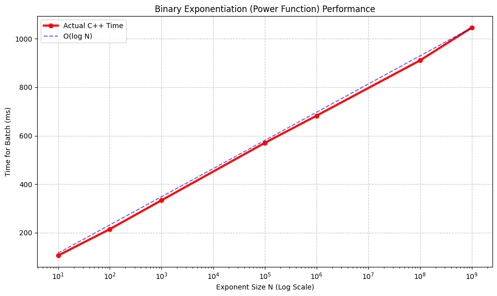

1)  **Tower of Hanoi**

**Aim**

Print the sequence of moves to transfer n disks from source to
destination using an auxiliary rod.

------------------------------------------------------------------------

**Algorithm: TOH(n, src, dest, aux)**

1.  If ( n \\leq 0 ), return

2.  If ( n = 1 ),

> Print \"Move disk 1 from src to dest\"
>
> Return

3.  Call ( TOH(n-1, src, aux, dest) )

4.  Print \"Move disk n from src to dest\"

5.  Call ( TOH(n-1, aux, dest, src) )

------------------------------------------------------------------------

**Time Complexity (TC)**

- ( O(2\^n) )

------------------------------------------------------------------------

**Space Complexity (SC)**

- ( O(n) ) (recursion stack)

------------------------------------------------------------------------

**Code**

void hanoi(int n, char from, char to, char aux_rod) 

    hanoi(n-1,from,aux_rod,to);

    hanoi(n-1,aux_rod,to,from);}

------------------------------------------------------------------------

**Use Cases**

- Understanding recursion deeply.

- Used in divide-and-conquer.

- Puzzle solving.

------------------------------------------------------------------------

**Graph**

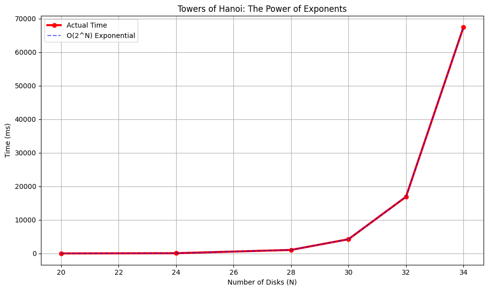

2)  **Permutations of a String**

**Aim**

Generate all permutations of a string using recursion and backtracking.

------------------------------------------------------------------------

**Algorithm: PERM(s, i)**

1.  If ( i = n ),

> Output the current permutation of string ( s )

Return

2.  For ( j = i ) to ( n-1 ):

> Swap ( s\[i\] ) and ( s\[j\] )
>
> Call ( PERM(s, i+1) )
>
> Swap back ( s\[i\] ) and ( s\[j\] )

------------------------------------------------------------------------

**Time Complexity (TC)**

- ( O(n!) )

------------------------------------------------------------------------

**Space Complexity (SC)**

- ( O(n) ) (recursion depth)

------------------------------------------------------------------------

**Code**

void permute(string &s, int l, int r) 

    for (int i = l; i \<= r; i++)}

------------------------------------------------------------------------

**Use Cases**

- Anagram generation

- Combinatorial problems

------------------------------------------------------------------------

**Graph**

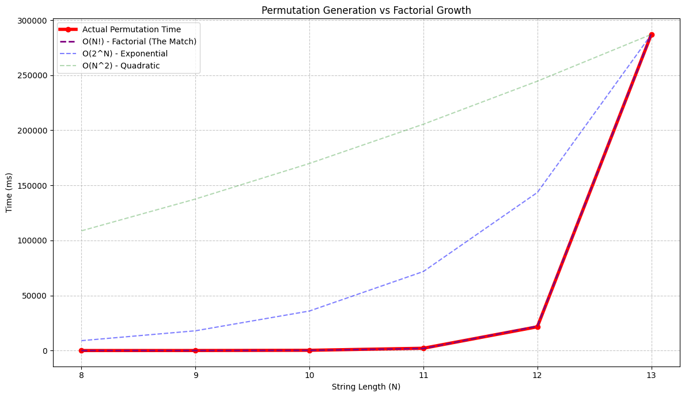

3)  **Velocity Reduction**

**Aim**

Count the number of steps required for a velocity ( v ) to drop below 1
when reduced by a fixed percentage at each step.

------------------------------------------------------------------------

**Algorithm: TIPS(v, t)**

1.  If ( v \< 1 ), return ( t )

2.  Set ( v = v \\times (1 - r) ) where ( r ) is reduction rate

3.  Return ( TIPS(v, t+1) )

------------------------------------------------------------------------

**Time Complexity (TC)**

- O(k), where ( k ) is number of reductions

------------------------------------------------------------------------

**Space Complexity (SC)**

- O(k)

------------------------------------------------------------------------

**Code**

int speed(float v,int i) 

------------------------------------------------------------------------

**Use Cases**

- Decay simulations

- Physics-based modeling

4)  **Horner\'s Rule**

**Aim**

Represent and evaluate a polynomial using Horner\'s Rule via recursion.

------------------------------------------------------------------------

**Algorithm: HR(i, arr)**

1.  If ( i = n-1 ), return ( arr\[i\] )

2.  Return ( arr\[i\] + x \\times HR(i+1, arr) )

------------------------------------------------------------------------

**Time Complexity (TC)**

- ( O(n) )

------------------------------------------------------------------------

**Space Complexity (SC)**

- ( O(n) )

------------------------------------------------------------------------

**Code**

string horners_rule(int i,const vector\<int\>& array) 

        else }

------------------------------------------------------------------------

**Use Cases**

- Polynomial evaluation

- Compiler optimizations

- Numerical computations

5)  **Finding Duplicate in a Consecutive Array**

**Aim**

Find the duplicate element in an array containing consecutive integers.

------------------------------------------------------------------------

**Algorithm: FIND-DUP(nums)**

1.  For ( i = 0 ) to ( n-1 ):

- If ( nums\[i\] \\neq i ), return ( nums\[i\] )

2.  Return -1

------------------------------------------------------------------------

**Time Complexity (TC)**

- ( O(n) )

------------------------------------------------------------------------

**Space Complexity (SC)**

- ( O(1) )

------------------------------------------------------------------------

**Code**

int dup2(vector\<int\>& arr) 

            }}

        return duplicate_value;}

**Use Cases**

- Data validation

- Detecting anomalies in sequences

6)  **Selection Sort**

**Aim**

Sort an array using recursive selection sort.

------------------------------------------------------------------------

**Algorithm: SS(arr, i)**

1.  If ( i \\geq n ), return

2.  Find index of minimum element in ( arr\[i \\dots n-1\] )

3.  Swap ( arr\[i\] ) with minimum element

4.  Call ( SS(arr, i+1) )

------------------------------------------------------------------------

**Time Complexity (TC)**

- ( O(n\^2) )

------------------------------------------------------------------------

**Space Complexity (SC)**

- ( O(n) )

------------------------------------------------------------------------

**Code**

void selectionSort(int\* arr, int n) }

    if (min_index!=i) }}

------------------------------------------------------------------------

**Use Cases**

- Learning sorting fundamentals

- Small datasets where simplicity matters

------------------------------------------------------------------------

**Graph:**

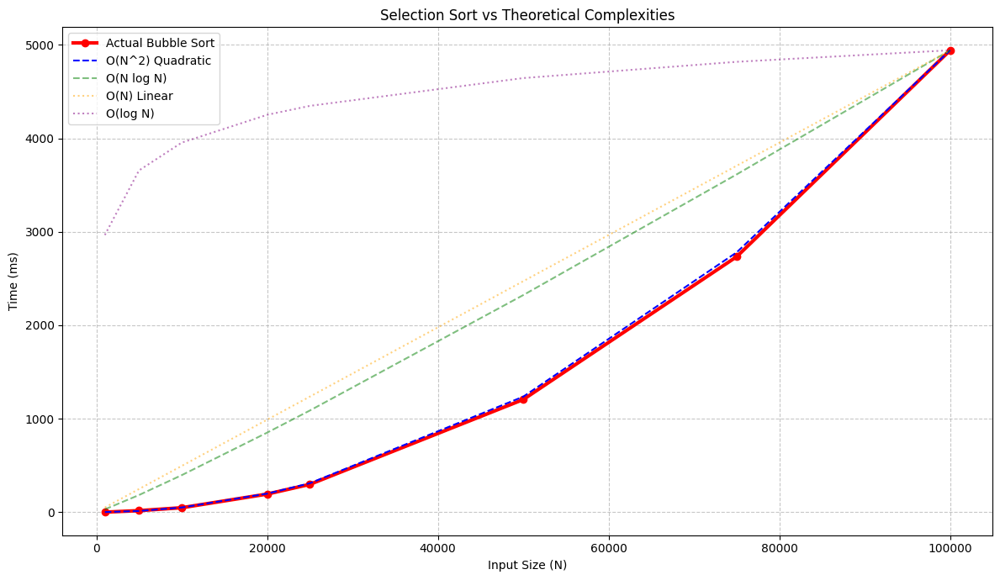

7)  **Bubble Sort**

**Aim**

Sort an array using recursive bubble sort and measure execution time.

**Algorithm: BB(arr, n)**

1.  If ( n = 1 ), return

2.  For ( i = 0 ) to ( n-2 ):

- If ( arr\[i\] \> arr\[i+1\] ), swap them

3.  Call ( BB(arr, n-1) )

------------------------------------------------------------------------

**Time Complexity (TC)**

- Best: ( O(n) )

- Average/Worst: ( O(n\^2) )

------------------------------------------------------------------------

**Space Complexity (SC)**

- ( O(n) )

------------------------------------------------------------------------

**Code**

void bubbleSort(int\* arr, int n) }}

}

------------------------------------------------------------------------

**Use Cases**

- Teaching sorting basics

- Understanding algorithm complexity

------------------------------------------------------------------------

**Graphs**

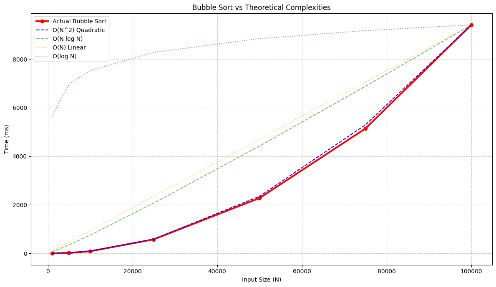

8)  **Linear Search**

**Aim**

Find a target element in an array using recursive linear search.

------------------------------------------------------------------------

**Algorithm: LS(arr, target, i)**

1.  If ( i \\geq n ), return -1

2.  If ( arr\[i\] = target ), return ( i )

3.  Return ( LS(arr, target, i+1) )

------------------------------------------------------------------------

**Time Complexity (TC)**

- Best: ( O(1) )

- Average/Worst: ( O(n) )

------------------------------------------------------------------------

**Space Complexity (SC)**

- ( O(n) )

------------------------------------------------------------------------

**Code**

int linear(int a\[\], int n, int i, int tar) 

------------------------------------------------------------------------

**Use Cases**

- Small datasets

- Basic searching problems

------------------------------------------------------------------------

9)  **Binary Search**

**Aim**

Search for a target in a sorted array using recursive binary search and
measure execution time.

------------------------------------------------------------------------

**Algorithm: BS(arr, t, s, e)**

1.  If ( s \> e ), return -1

2.  Compute ( m = \\lfloor (s+e)/2 \\rfloor )

3.  If ( arr\[m\] = t ), return ( m )

4.  If ( arr\[m\] \> t ), return ( BS(arr, t, s, m-1) )

5.  Else return ( BS(arr, t, m+1, e) )

------------------------------------------------------------------------

**Time Complexity (TC)**

- Best: O(1)

- Average/Worst: O(\\log n)

------------------------------------------------------------------------

**Space Complexity (SC)**

- O(\\log n)

------------------------------------------------------------------------

**Code**

public static int BS(int\[\] arr, int t, int s, int e) 

------------------------------------------------------------------------

**Use Cases**

- Efficient searching in sorted data

- Databases and lookup systems

------------------------------------------------------------------------

**Graphs**

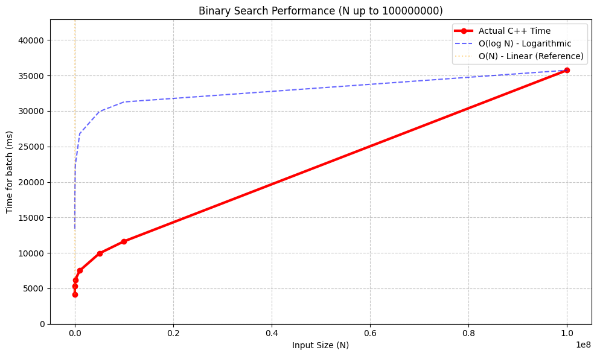

10) **Insertion Sort**

**Aim**

Sort an array using insertion sort and measure performance.

------------------------------------------------------------------------

**Algorithm: IS(arr)**

1.  For ( i = 1 ) to ( n-1 ):

    - Set ( key = arr\[i\] )

    - Set ( j = i-1 )

    - While ( j \\geq 0 ) and ( arr\[j\] \> key ):

> Shift ( arr\[j\] ) to ( arr\[j+1\] )
>
> Decrement ( j )

- Insert ( key ) at position ( j+1 )

------------------------------------------------------------------------

**Time Complexity (TC)**

- Best: ( O(n) )

- Average/Worst: ( O(n\^2) )

------------------------------------------------------------------------

**Space Complexity (SC)**

- ( O(1) )

------------------------------------------------------------------------

**Code**

void insertionSort(int\* arr, int n) 

        arr\[j+1\]=key;}}

------------------------------------------------------------------------

**Use Cases**

- Small datasets

- Nearly sorted arrays

- Online/incremental sorting

------------------------------------------------------------------------

**Graphs**

a)  **Best case insertion sort**

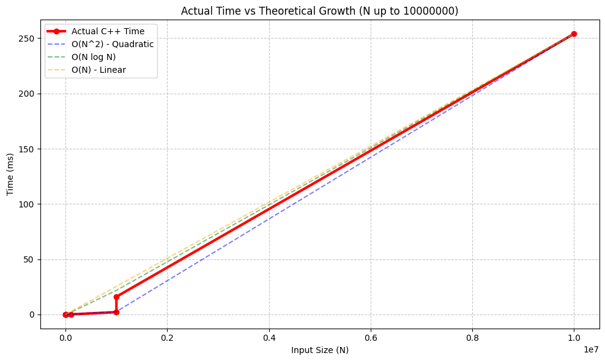

b)  **average insertion sort case**

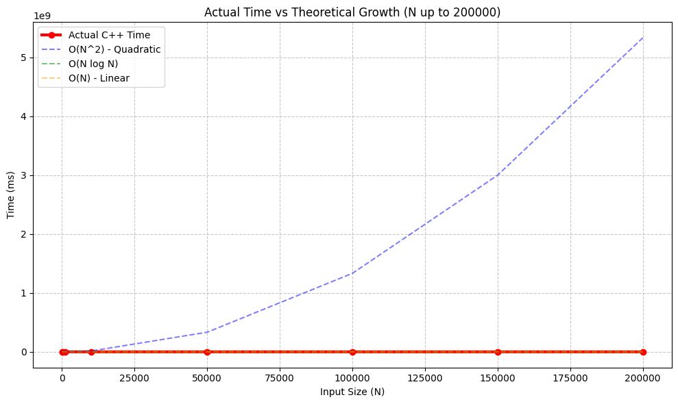

c)  **worst insertion sort case**

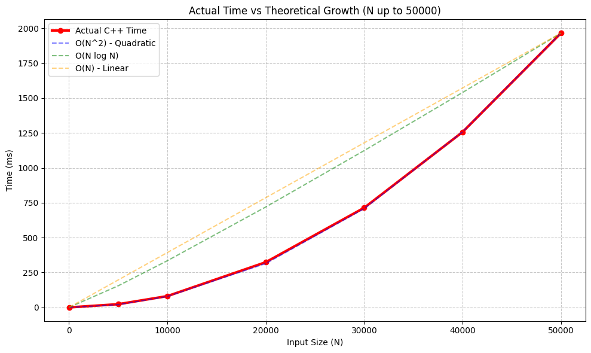

11) **Merge Sort**

**Aim**

Sort an array using merge sort and analyze performance for different
input sizes.

------------------------------------------------------------------------

**Algorithm: MS(arr, s, e)**

1.  If ( s \\geq e ), return

2.  Compute ( m = \\lfloor (s+e)/2 \\rfloor )

3.  Call ( MS(arr, s, m) )

4.  Call ( MS(arr, m+1, e) )

5.  Merge the two sorted halves

------------------------------------------------------------------------

**Time Complexity (TC)**

- O(n \\log n) (all cases)

------------------------------------------------------------------------

**Space Complexity (SC)**

- O(n)

------------------------------------------------------------------------

**Code**

void merge(vector\<int\>& arr, int low, int mid, int high)

        while (left \<= mid)

            temp.push_back(arr\[left++\]);

        while (right \<= high)

            temp.push_back(arr\[right++\]);

        for (int i = low; i \<= high; i++)

            arr\[i\] = temp\[i - low\];

    }

------------------------------------------------------------------------

**Use Cases**

- Large datasets

- Stable sorting requirements

------------------------------------------------------------------------

**Graphs** 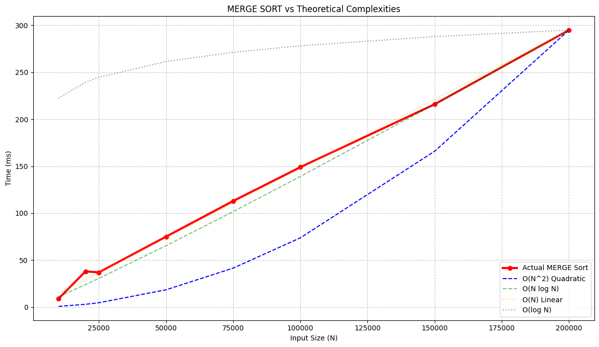

12) **Quick Sort**

**Aim**

Sort using quick sort and observe performance characteristics.

------------------------------------------------------------------------

**Algorithm: QS(arr, s, e)**

1.  If ( s \\geq e ), return

2.  Choose pivot element

3.  Partition array such that:

    - Elements \< pivot on left

    - Elements \> pivot on right

4.  Recursively apply on left and right partitions

------------------------------------------------------------------------

**Time Complexity (TC)**

- Best/Average: ( O(n \\log n) )

- Worst: ( O(n\^2) )

------------------------------------------------------------------------

**Space Complexity (SC)**

- Average: ( O(\\log n) )

- Worst: ( O(n) )

------------------------------------------------------------------------

**Code**

int partion(vector\<int\>& arr, int low,int high)}

    swap(arr\[i+1\],arr\[high\]);

    return i+1;}

    void quicksort(vector\<int\>& arr, int low, int high) }

------------------------------------------------------------------------

**Use Cases**

- General-purpose in-memory sorting

- High-performance applications

------------------------------------------------------------------------

**Graphs**

a)  **Worst case**

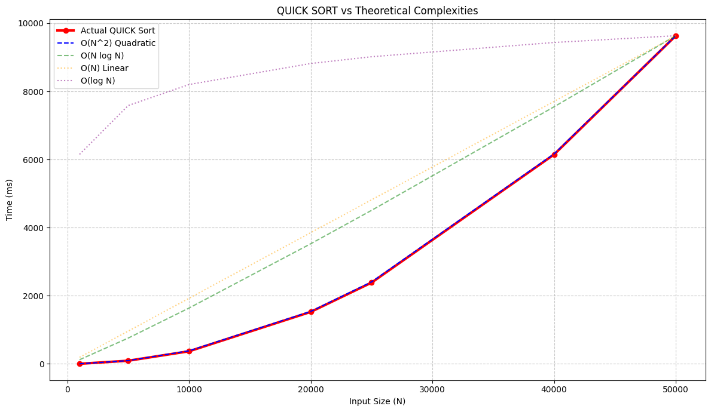

b)  **average case**

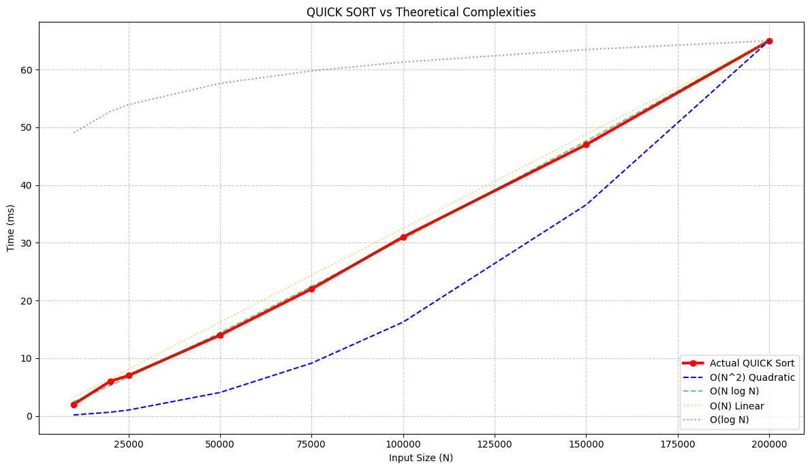

c)  **best case**

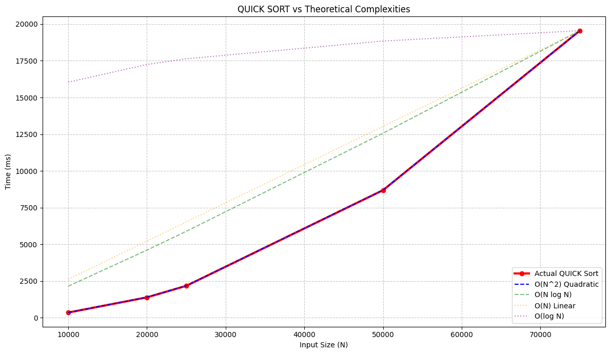

13) **MIN-MAX PROBLEM**

**Aim**

Compute the min and max in an given array using the divide and conquer

------------------------------------------------------------------------

**Algorithm: MIN_MAX(arr, low, high)**

1.  If low == high\
    → Return (arr\[low\], arr\[low\])

2.  If high == low + 1\
    → Compare both elements\
    → Return (min, max)

3.  Find mid:

mid = (low + high) / 2

4.  Recursively find:

    - Left result = MIN_MAX(arr, low, mid)

    - Right result = MIN_MAX(arr, mid+1, high)

5.  Combine results:

    - Final Min = min(left.min, right.min)

    - Final Max = max(left.max, right.max)

6.  Return (Final Min, Final Max)

------------------------------------------------------------------------

**Time Complexity (TC)**

- O(n )

------------------------------------------------------------------------

**Space Complexity (SC)**

- O(log n)

------------------------------------------------------------------------

**Code**

pair\<int,int\> MIN_MAX(int\* arr, int low, int high) ;}

    if(high==low + 1);

        else

            return ;}

    int mid = (low + high)/2;

    pair\<int,int\> left = MIN_MAX(arr, low, mid);

    pair\<int,int\> right = MIN_MAX(arr, mid+1, high);

    int fMin = min(left.first, right.first);

    int fMax = max(left.second, right.second);

    return ;}

14) **Convex Hull**

> **Aim**
>
> Compute the convex hull of a set of planar points using monotone chain
> (or Graham scan style).
>
> **Algorithm: CONVEX-HULL(points)**

1.  Sort points by x-coordinate, then by y-coordinate

2.  Build lower hull:

    - For each point, remove last point while it makes a non-left turn

3.  Build upper hull similarly in reverse order

4.  Concatenate lower and upper hulls

> **Time Complexity (TC)**

- O(n \\log n)

> **Space Complexity (SC)**

- O(n)

> **Code**
>
> struct Point ;
>
> int cross(Point O,Point A,Point B) 
>
> int main() ,,,,,,};
>
>     int n=pts.size();
>
>     sort(pts.begin(),pts.end(),\[\](Point a,Point b) );
>
>     vector\<Point\> hull;
>
>     for(int i=0;i\<n;i++) 
>
>         hull.push_back(pts\[i\]);}
>
>     int lowerSize=hull.size();
>
>     for(int i=n-2;i\>=0;i\--) 
>
>         hull.push_back(pts\[i\]);}
>
>     hull.pop_back();
>
>     cout\<\<\"Convex Hull Points\\n\";
>
>     for(auto p:hull) 
>
>     return 0;}
>
> **Graphs**
>
> 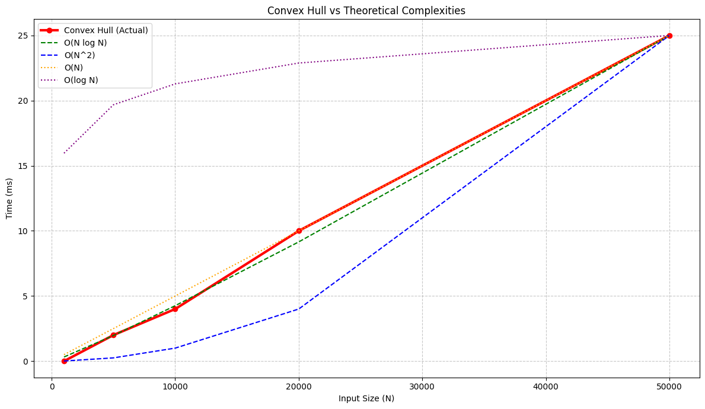

15) **Fractional Knapsack**

**Aim**

Maximize value in a knapsack allowing fractional items using a greedy
approach.

------------------------------------------------------------------------

**Algorithm: KNAPSACK(W, wt, val)**

1.  Compute value/weight ratio for each item

2.  Sort items in decreasing order of ratio

3.  For each item:

    - Take as much as possible (fully or fractionally)

    - Reduce remaining capacity ( W )

4.  Return total value

------------------------------------------------------------------------

**Time Complexity (TC)**

- ( O(n \\log n) )

------------------------------------------------------------------------

**Space Complexity (SC)**

- ( O(1) )

------------------------------------------------------------------------

**Code**

struct Item ;

bool cmp(Item a,Item b) 

int main() ,

        ,

        ,

        ,

        };

    int n = sizeof(arr)/sizeof(arr\[0\]);

    int W = 50;

    sort(arr, arr + n, cmp);

    double totalvalue = 0.0;

    cout \<\< \"Items taken:\\n\";

    for(int i = 0; i \< n; i++)

        else }

    cout \<\< \"Maximum value: \" \<\< totalvalue \<\< endl;

    return 0;

}

**Graphs**

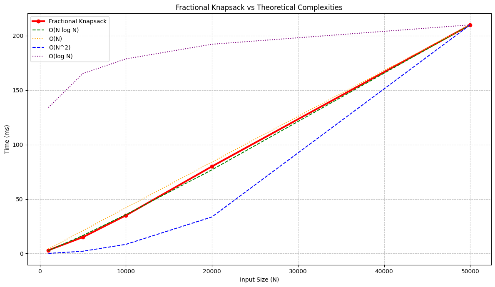

16) **Matrix Multiplication (Naive Method)**

**Aim**

To multiply two square matrices of size **n × n** using the **standard
(naive) algorithm** and measure the execution time.

------------------------------------------------------------------------

**Algorithm: matrix(A, B, C)**

1.  Initialize matrix C with zeros

2.  For each row i from 0 → n-1

3.  For each column j from 0 → n-1

4.  Compute:

C\[i\]\[j\] = Σ (A\[i\]\[k\] \* B\[k\]\[j\]) for k = 0 → n-1

5.  Store result in matrix C

------------------------------------------------------------------------

**Time Complexity (TC)**

- O(n³)

------------------------------------------------------------------------

**Space Complexity (SC)**

- O(n²)

------------------------------------------------------------------------

**Code:**

void multiplyMatrices(vector\<vector\<int\>\>&
A,vector\<vector\<int\>\>& B,vector\<vector\<int\>\>& C) }}}

void generateMatrix(vector\<vector\<int\>\>& M) 

int main() 

------------------------------------------------------------------------

**Graph:**

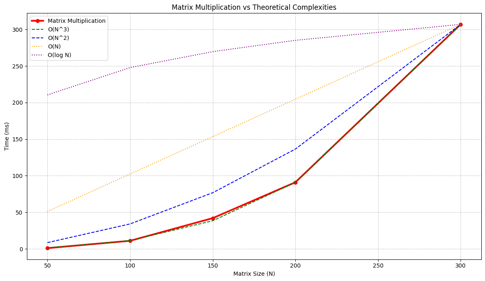

17) **Stresson (Dynamic Programming)**

**Aim**

To determine the minimum number of scalar multiplications required to
multiply a chain of matrices using Dynamic Programming.

------------------------------------------------------------------------

**Algorithm: MATRIX_CHAIN_ORDER(p, n)**

1.  Let m\[i\]\[j\] store minimum cost

2.  Initialize:

    - m\[i\]\[i\] = 0 (single matrix → no cost)

3.  For chain length len = 2 → n-1

4.  For each i:

    - Compute j = i + len - 1

    - Set m\[i\]\[j\] = ∞

5.  Try all possible splits k = i → j-1

    - Compute cost:

m\[i\]\[k\] + m\[k+1\]\[j\] + p\[i-1\]\*p\[k\]\*p\[j\]

- Take minimum

6.  Final answer = m\[1\]\[n-1\]

------------------------------------------------------------------------

**Time Complexity (TC)**

- O(n³)

------------------------------------------------------------------------

**Space Complexity (SC)**

- O(n²)

------------------------------------------------------------------------

**Code:**

#include \<iostream\>

#include \<climits\>

using namespace std;

#define N 5

int main() ;

    int m\[N\]\[N\];

    for(int i = 1; i \< N; i++)

        m\[i\]\[i\] = 0;

    for(int len = 2; len \< N; len++) }}

    cout\<\<\"Minimum multiplication cost \"\<\<m\[1\]\[N-1\]\<\<endl;

    return 0;

}

------------------------------------------------------------------------

**Graph:**

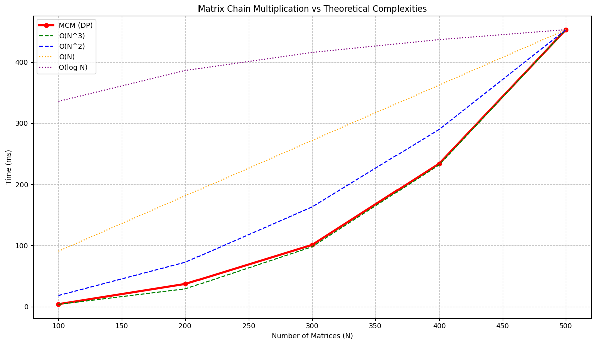

18) **Activity Selection Problem (Greedy Method)**

**Aim**

To select the maximum number of non-overlapping activities from a given
set using a greedy approach.

------------------------------------------------------------------------

**Algorithm: ACTIVITY_SELECTION(arr, n)**

1.  Sort activities based on **increasing finish time**

2.  Select the first activity

3.  Initialize lastFinish = finish time of first activity

4.  For each remaining activity:

    - If start \>= lastFinish

      - Select the activity

      - Update lastFinish

5.  Print selected activities

------------------------------------------------------------------------

**Time Complexity (TC)**

- Sorting → O(n log n)

- Selection loop → O(n)\
  👉 Overall: O(n log n)

------------------------------------------------------------------------

**Space Complexity (SC)**

- O(1)

------------------------------------------------------------------------

**Code:**

#include \<iostream\>

#include \<algorithm\>

using namespace std;

struct act;

bool cmp(act a,act b) 

int main() , , , ,

        , };

    int n = sizeof(arr)/sizeof(arr\[0\]);

    sort(arr, arr + n, cmp);

    cout \<\< \"Selected activities:\\n\";

    int lastFinish = arr\[0\].finish;

    cout \<\< \"(\" \<\< arr\[0\].start \<\< \",\" \<\< arr\[0\].finish
\<\< \")\\n\";

    for(int i = 1; i \< n; i++) }

    return 0;

}

19) **Dijkstra\'s Shortest Path**

**Aim**

Compute shortest paths from a single source in a weighted graph with
non-negative weights.

------------------------------------------------------------------------

**Algorithm: DIJKSTRA(graph, src)**

1.  Initialize distance array with infinity, set ( dist\[src\] = 0 )

2.  Use a priority queue to select node with minimum distance

3.  For each adjacent vertex:

    - Update distance if a shorter path is found

4.  Repeat until all vertices are processed

------------------------------------------------------------------------

**Time Complexity (TC)**

- ( O((V + E) \\log V) )

------------------------------------------------------------------------

**Space Complexity (SC)**

- ( O(V) )

------------------------------------------------------------------------

**Code**

#include \<iostream\>

#include \<climits\>

using namespace std;

#define V 5

int main() ,

        ,

        ,

        ,

        };

    int dist\[V\];

    bool visited\[V\];

    for(int i = 0; i \< V; i++) 

    dist\[0\] = 0;

    for(int j = 0; j \< V-1; j++) }

        visited\[u\]=true;

        for(int v = 0; v \< V; v++) }}

    cout\<\<\"Shortest distances from source (0):\\n\";

    for(int i = 0; i \< V; i++)

    return 0;

}

------------------------------------------------------------------------

**Graphs:**

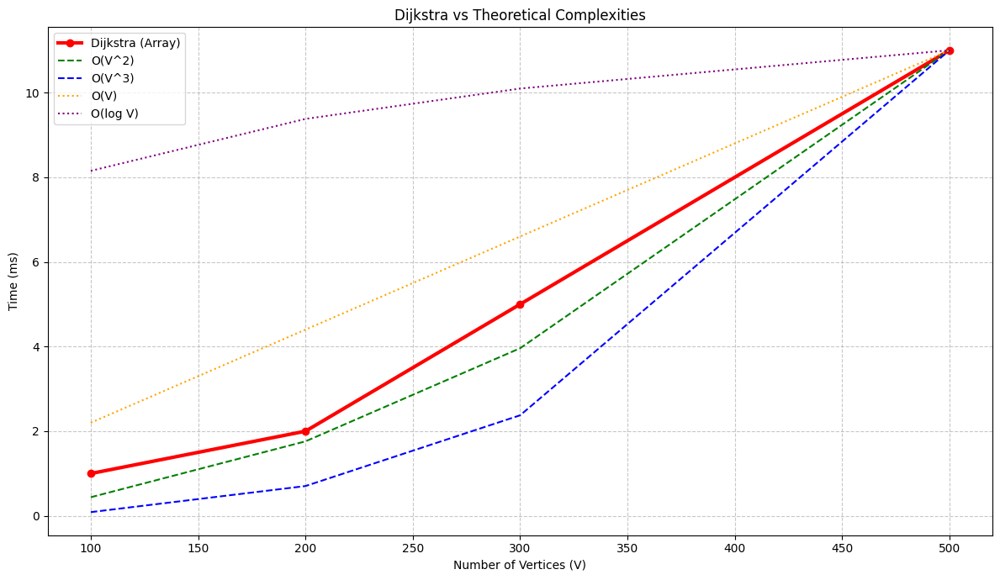

20) **Prim\'s Algorithm for MST**

**Aim**

Construct a Minimum Spanning Tree using Prim\'s greedy approach.

------------------------------------------------------------------------

**Algorithm: PRIMS(graph)**

1.  Initialize all vertices as not included in MST

2.  Start from any vertex (e.g., 0)

3.  Select minimum weight edge connecting MST to a new vertex

4.  Add selected vertex to MST

5.  Repeat until all vertices are included

------------------------------------------------------------------------

**Time Complexity (TC)**

- ( O(V\^2) ) (matrix)

- ( O(E \\log V) ) (with heap)

------------------------------------------------------------------------

**Space Complexity (SC)**

- ( O(V) )

------------------------------------------------------------------------

**Code**

#include \<iostream\>

#include \<climits\>

using namespace std;

#define N 5

int main() ,

        ,

        ,

        ,

        };

    int key\[N\];        // minimum edge weight

    int parent\[N\];     // store MST

    bool inMST\[N\];     // visited set

    for(int i = 0; i \< N; i++) 

    key\[0\] = 0;      

    parent\[0\] = -1;

    for(int c = 0; c \< N-1; c++) }

        inMST\[u\] = true;

        for(int v = 0; v \< N; v++) }}

    int total = 0;

    cout\<\<\"Edges in MST:\\n\";

    for(int i = 1; i \< N; i++) 

    cout \<\< \"Total cost: \" \<\< total \<\< endl;

    return 0;

}

------------------------------------------------------------------------

**Graph:**

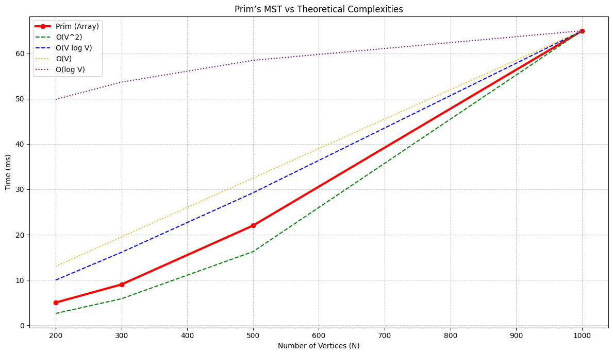

21) **Kruskal\'s Algorithm for MST**

**Aim**

Construct a Minimum Spanning Tree by sorting edges and avoiding cycles
using union-find.

------------------------------------------------------------------------

**Algorithm: KRUSKAL(edges, V)**

1.  Sort all edges by weight

2.  Initialize disjoint sets for all vertices

3.  For each edge:

    - If it connects two different sets, include it in MST

    - Union the sets

4.  Repeat until MST has ( V-1 ) edges

------------------------------------------------------------------------

**Time Complexity (TC)**

- ( O(E \\log E) )

------------------------------------------------------------------------

**Space Complexity (SC)**

- ( O(V + E) )

------------------------------------------------------------------------

**Code**

#include \<iostream\>

#include \<algorithm\>

using namespace std;

#define V 5

#define E 7

struct Edge ;

int parent\[V\];

int find(int x) 

void unite(int x, int y) 

bool cmp(Edge a, Edge b) 

int main() ,,,,, ,};

    sort(edges, edges + E, cmp);

    for(int i = 0; i \< V; i++)

        parent\[i\] = i;

    int total = 0;

    cout \<\< \"Edges in MST:\\n\";

    for(int i = 0; i \< E; i++) }

    cout\<\<\"Total cost \"\<\<total\<\<endl;

    return 0;

}

------------------------------------------------------------------------

**Graphs**

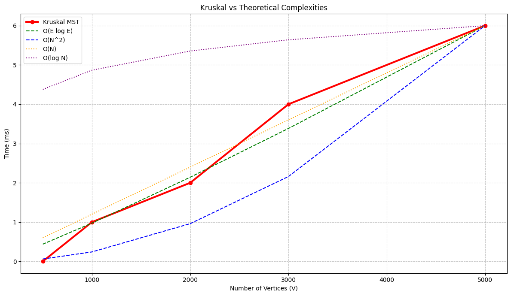

22) **Shortest path using Dijkstra's Algorithm**

**Aim**

To find the shortest path from a source vertex to all other vertices in
a weighted graph with non-negative edge weights.

------------------------------------------------------------------------

**Algorithm: DIJKSTRA(graph, source)**

1.  Initialize:

    - dist\[i\] = ∞ for all vertices

    - dist\[source\] = 0

    - visited\[i\] = false

    - parent\[i\] = -1

2.  Repeat **V-1 times**:

    - Select vertex u with **minimum distance** not visited

    - Mark u as visited

3.  For each adjacent vertex v:

    - If not visited and edge exists:

if dist\[u\] + weight(u,v) \< dist\[v\]\
update dist\[v\]\
parent\[v\] = u

4.  Print distances and paths

------------------------------------------------------------------------

**Time Complexity (TC)**

- O(v\^2)

------------------------------------------------------------------------

**Space Complexity (SC)**

- O(V)

------------------------------------------------------------------------

**Code:**

#include \<iostream\>

#include \<climits\>

using namespace std;

#define V 5

void printPath(int parent\[\], int j) 

int main() ,

        ,

        ,

        ,

        };

    int dist\[V\];

    bool visited\[V\];

    int parent\[V\];

    for(int i = 0; i \< V; i++) 

    dist\[0\] = 0;

    for(int j = 0; j \< V-1; j++) }

        visited\[u\]=true;

        for(int v = 0; v \< V; v++) }}

    cout\<\<\"Shortest distances from source (0):\\n\";

    for(int i=0;i\<V;i++) 

    return 0;

}

23) **Cycle Detection in Directed Graph (DFS)**

**Aim**

To detect whether a directed graph contains a cycle using Depth First
Search (DFS).

------------------------------------------------------------------------

**Algorithm: IS_CYCLIC(V, edges)**

1.  Create adjacency list from edges

2.  Initialize:

    - vis\[i\] = 0

    - path\[i\] = 0

3.  For each node:

    - If not visited → call DFS

4.  In DFS:

    - Mark node visited and in path

    - For each neighbor:

      - If not visited → recurse

      - If already in path → cycle found

5.  Backtrack:

    - Remove node from path

------------------------------------------------------------------------

**Time Complexity (TC)**

- O(V + E)

------------------------------------------------------------------------

**Space Complexity (SC)**

- O(V)

------------------------------------------------------------------------

**Code:**

#include \<bits/stdc++.h\>

#include \<vector\>

#include \<queue\>

#include \<iostream\>

#include \<algorithm\>

using namespace std;

    bool dfs( int node , vector\<vector\<int\>\>& adj , int vis\[\] ,
int path\[\] )

            else if ( path\[it\] )

                return true ;

   }

   path\[node\]=0;

    return false;  }

    bool isCyclic(int V, vector\<vector\<int\>\> &edges) 

int path\[V\];

int vis\[V\];

for (int i =0 ; i \< V ; i++ )

for ( int i =0 ; i\< V ; i++)

    }

    return false ;

}

int main(), , , };  

    if (isCyclic(V, edges))  else 

    return 0;

}

24) **Multistage Graph (Backward Approach)**

**Aim**

Find shortest path in a multistage graph using backward approach.

------------------------------------------------------------------------

**Algorithm: MULTISTAGE(graph, N)**

1.  Set:

    - cost\[N-1\] = 0 (destination)

2.  For i = N-2 → 0:

    - Initialize cost\[i\] = ∞

3.  For each j \> i:

    - If edge exists:

      - Compute:

graph\[i\]\[j\] + cost\[j\]

- Take minimum

- Store j in path\[i\]

4.  Final answer = cost\[0\]

------------------------------------------------------------------------

**Time Complexity (TC)**

- O(V\^2)

------------------------------------------------------------------------

**Space Complexity (SC)**

- O(V)

------------------------------------------------------------------------

**Code**

#include \<iostream\>

#include \<climits\>

using namespace std;

#define N 8  // number of nodes

int main() ;

    int graph\[N\]\[N\] = ,

        ,

        ,

        ,

        ,

        ,

        ,

        };

    int cost\[N\];

    cost\[N-1\] = 0;

    for(int i = N-2; i \>= 0; i\--) }}}

    cout\<\<\"Minimum cost \"\<\<cost\[0\]\<\<endl;

    for( int j = 0 ; j\< N ; j++ )

    return 0;

}

**Use Cases**

- Shortest path in staged graphs

- Network optimization

- DAG-based DP problems

25) **Multistage Graph (Forward Approach)**

**Aim**

Find shortest path in a multistage graph using forward dynamic
programming.

------------------------------------------------------------------------

**Algorithm**

1.  If i == destination → return 0

2.  If cost\[i\] already computed → return it

3.  Try all k \> i:

    - If edge exists:

      - Compute:

> graph\[i\]\[k\] + solve(k)

4.  Store minimum in cost\[i\]

5.  Track next node in path\[i\]

------------------------------------------------------------------------

**Time Complexity (TC)**

- O(V\^2)

------------------------------------------------------------------------

**Space Complexity (SC)**

- O(V)

------------------------------------------------------------------------

**Code**

#include \<iostream\>

#include \<climits\>

using namespace std;

#define N 8

int solve(int graph\[N\]\[N\], int i, int j, int cost\[N\], int
path\[N\]) }}

    return cost\[i\];}

int main() 

    int graph\[N\]\[N\] = ,

        ,

        ,

        ,

        ,

        ,

        ,

         };

    solve(graph, 0, N-1, cost, path);

    cout \<\< \"Minimum cost: \" \<\< cost\[0\] \<\< endl;

    cout \<\< \"Path: \";

    int i = 0;

    while(i != -1) 

    return 0;}

------------------------------------------------------------------------

**Use Cases**

- Dynamic programming on DAGs

- Decision optimization problems

- Multistage shortest path

26) **Matrix Chain Multiplication**

**Aim**

Find the optimal parenthesization of matrices to minimize scalar
multiplications.

------------------------------------------------------------------------

**Algorithm: MATRIX-CHAIN(p)**

1.  Let ( n = length(p) - 1 )

2.  Initialize ( m\[i\]\[i\] = 0 )

3.  For chain length ( L = 2 ) to ( n ):

    - For ( i = 1 ) to ( n-L+1 ):

      - Set ( j = i + L - 1 )

      - Set ( m\[i\]\[j\] = \\infty )

      - For ( k = i ) to ( j-1 ):

        - Compute cost

        - Update minimum value

------------------------------------------------------------------------

**Time Complexity (TC)**

- O(n\^3)

------------------------------------------------------------------------

**Space Complexity (SC)**

- O(n\^2)

------------------------------------------------------------------------

**Code**

int mul(vector\<int\>& arr, int i , int j , vector\<vector\<int\>\> &dp
)

    if( dp\[i\]\[j\] != -1 )

        return dp\[i\]\[j\];

    int res = INT_MAX;

        for( int k = i + 1 ; k \< j ; k++ )

        return dp\[i\]\[j\] = res;}

------------------------------------------------------------------------

**Use Cases**

- Optimizing matrix operations in scientific computing

- Compiler optimization (expression evaluation order)

- Graphics transformations

------------------------------------------------------------------------

**Graphs**

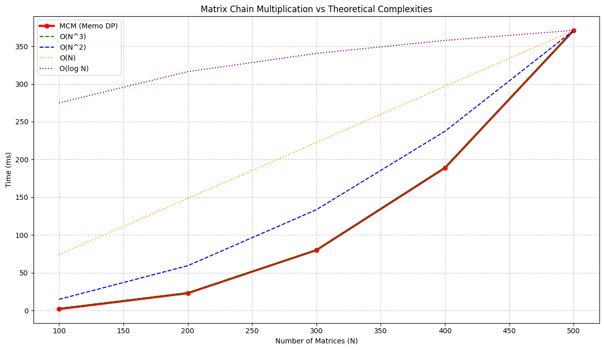

27) **All Pairs Shortest Path**

**Aim**

Compute shortest paths between all pairs of vertices.

------------------------------------------------------------------------

**Algorithm: solve(dist)**

1.  For each vertex ( k ):

2.  For each pair ( (i, j) ):

    - Update ( dist\[i\]\[j\] = \\min(dist\[i\]\[j\], dist\[i\]\[k\] +
      dist\[k\]\[j\]) )

------------------------------------------------------------------------

**Time Complexity (TC)**

- O(V\^3)

------------------------------------------------------------------------

**Space Complexity (SC)**

- O(V\^2)

------------------------------------------------------------------------

**Code**

#include \<bits/stdc++.h\>

using namespace std;

void floydWarshall(vector\<vector\<int\>\>& dist, int V) 

}

// Floyd-Warshall logic

for (int k = 0; k \< V; k++) 

}

}

}

// Print result of the code

cout \<\< \"All-pairs shortest distances:\\n\";

for (int i = 0; i \< V; i++) 

cout \<\< \"\\n\";

}}

int main() ,

,

,

 }

floydWarshall(graph, V);

return 0;}

**Use Cases**

- Network routing protocols

- Shortest path in dense graphs

- Transitive closure (reachability problems)

------------------------------------------------------------------------

**Graphs**

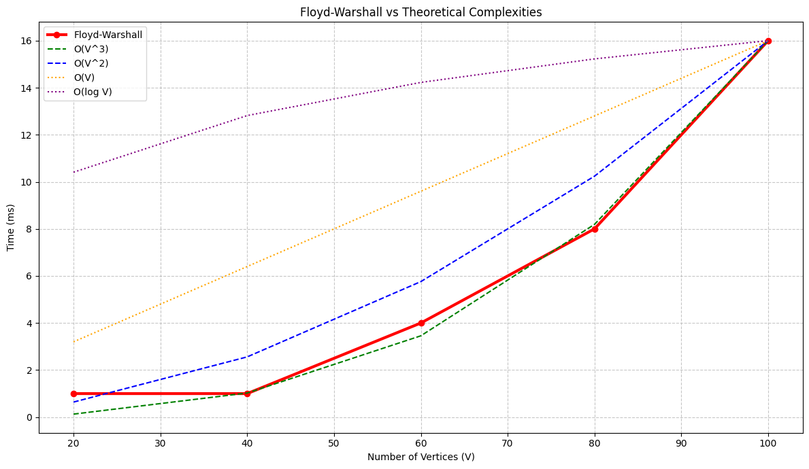

28) **Longest Common Subsequence**

**Aim**

Find the longest common subsequence between two strings using dynamic
programming.

------------------------------------------------------------------------

**Algorithm: LCS(X, Y)**

1.  Let ( m = length(X), n = length(Y) )

2.  Create table ( c\[m+1\]\[n+1\] )

3.  Fill table:

    - If characters match → diagonal + 1

    - Else → max of top or left

4.  Use a direction table to reconstruct LCS

5.  Backtrack to print the subsequence

------------------------------------------------------------------------

**Time Complexity (TC)**

- O(m \\cdot n)

------------------------------------------------------------------------

**Space Complexity (SC)**

- O(m \\cdot n)

------------------------------------------------------------------------

**Code:**

int solve( int i , int j , string &s1 , string &s2 ,
vector\<vector\<int\>\> & dp )

------------------------------------------------------------------------

**Use Cases**

- DNA sequence alignment

- Text comparison (diff tools)

- Version control systems

- Plagiarism detection

29) **0/1 Knapsack (Dynamic Programming)**

**Aim**

Maximize total value in a knapsack without exceeding capacity, where
each item can be taken at most once.

------------------------------------------------------------------------

**Algorithm: KNAPSACK(weights, values, capacity)**

1.  Let ( n = number\\ of\\ items )

2.  Create DP table ( dp\[n+1\]\[capacity+1\] )

3.  For each item ( i ) and weight ( w ):

    - If item can be included:\
      \[ dp\[i\]\[w\] = \\max(dp\[i-1\]\[w\],\\ dp\[i-1\]\[w -
      weight\[i\]\] + value\[i\]) \]

    - Else: \[ dp\[i\]\[w\] = dp\[i-1\]\[w\] \]

4.  Return ( dp\[n\]\[capacity\] )

------------------------------------------------------------------------

**Time Complexity (TC)**

- ( O(n \\cdot W) )

------------------------------------------------------------------------

**Space Complexity (SC)**

- ( O(n \\cdot W) )

------------------------------------------------------------------------

**Code (Important Function)**

int solve( int ind , int w , vector\<int\> &val , vector\<int\>& wt ,
vector\<vector\<int\>\> &dp )

if( dp\[ind\]\[w\] != -1)

return dp\[ind\]\[w\];

int not_take = solve( ind - 1 , w , val , wt , dp );

int take = 0;

if( wt\[ind\] \<= w )

return dp\[ind\]\[w\] = max( take , not_take );

}

**Use Cases**

- Resource allocation problems

- Budget optimization

- Cargo loading and logistics

- Investment decision making

**Graphs**

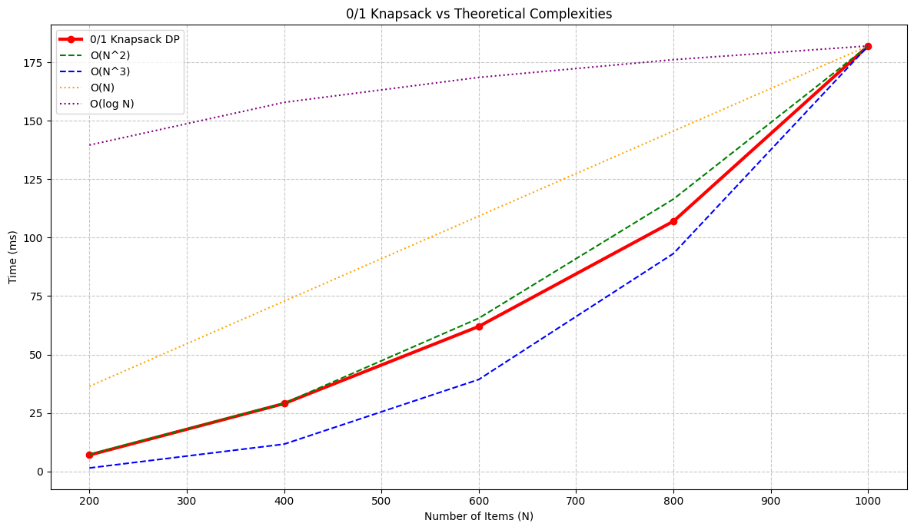

30) **Traveling Salesman Problem (Dynamic Programming)**

**Aim**

Solve TSP efficiently using Dynamic Programming (Bitmasking).

------------------------------------------------------------------------

**Algorithm: TSP-DP(n, cost)**

1.  Use bitmask to represent visited cities

2.  Initialize DP table

3.  Iterate over all subsets of cities

4.  Update minimum cost for each subset

5.  Return minimum cost including return to source

------------------------------------------------------------------------

**Time Complexity (TC)**

- ( O(n\^2 \\cdot 2\^n) )

------------------------------------------------------------------------

**Space Complexity (SC)**

- ( O(n \\cdot 2\^n) )

------------------------------------------------------------------------

**Code**

using namespace std;

int solve( int i , int next , vector\<vector\<int\>\> &cost ,
vector\<vector\<int\>\> &dp) 

    }

    return dp\[i\]\[next\] = ans;

}

int  main(),

    ,

    ,

    

};

vector\<vector\<int\>\> dp( cost.size() , vector\<int\>(1\<\<cost.size()
, -1));

cout\<\<solve( 0 , ((1 \<\< cost.size()) - 1) \^ 1 , cost , dp
)\<\<endl;

    return 0;

}

------------------------------------------------------------------------

**Use Cases**

- Logistics and route planning

- Circuit design

- Optimization problems with constraints

31) **Graph coloring**

**Aim**

Assign colors to vertices such that no two adjacent vertices share the
same color.

------------------------------------------------------------------------

**Algorithm: GRAPH-COLORING(graph, m)**

1.  Assign colors one by one to vertices

2.  Check if current color assignment is safe

3.  If safe, recurse for next vertex

4.  If all vertices are colored, solution found

------------------------------------------------------------------------

**Time Complexity (TC)**

- Exponential in worst case

------------------------------------------------------------------------

**Space Complexity (SC)**

- ( O(n) )

------------------------------------------------------------------------

**Code**

static boolean isSafe(int v, int c, int\[\]\[\] graph, int\[\] color,
int n) 

static void solve(int v, int\[\]\[\] graph, int\[\] color, int n, int m)

for (int c = 1; c \<= m; c++) 

}

}

------------------------------------------------------------------------

**Use Cases**

- Register allocation in compilers

- Scheduling problems

- Frequency/channel assignment

32) **Hamiltonian Cycle**

**Aim**

Find a Hamiltonian cycle in a graph using backtracking.

------------------------------------------------------------------------

**Algorithm: HAMILTONIAN(graph)**

1.  Start from a vertex

2.  Recursively add vertices to path

3.  Check if all vertices are visited exactly once

4.  Verify if last vertex connects to first

------------------------------------------------------------------------

**Time Complexity (TC)**

- ( O(n!) )

------------------------------------------------------------------------

**Space Complexity (SC)**

- ( O(n) )

------------------------------------------------------------------------

**Code**

#include \<bits/stdc++.h\>

using namespace std;

bool isSafe(int v, vector\<vector\<int\>\>& graph,

            vector\<int\>& path, vector\<bool\>& visited, int pos) 

bool solve(vector\<vector\<int\>\>& graph,

           vector\<int\>& path, vector\<bool\>& visited,

           int pos, int V) 

    for (int v = 1; v \< V; v++) 

    }

    return false;

}

int main() ,

        ,

        ,

        ,

        

    };

    int V = graph.size();

    vector\<int\> path(V, -1);

    vector\<bool\> visited(V, false);

    path\[0\] = 0;

    visited\[0\] = true;

    if (solve(graph, path, visited, 1, V))  else 

    return 0;

33) **N-Queens Problem**

**Aim**

Place N queens on an ( N \\times N ) chessboard such that no two queens
attack each other.

------------------------------------------------------------------------

**Algorithm (Backtracking)**

**Algorithm: N-QUEENS(k, x, n)**

1.  If ( k = n ), a solution is found

2.  For each column ( i = 0 ) to ( n-1 ):

    - Check if placing queen at ( (k, i) ) is safe

    - If safe:

      - Place queen

      - Recurse for next row

------------------------------------------------------------------------

**Time Complexity (TC)**

- ( O(n!) )

------------------------------------------------------------------------

**Space Complexity (SC)**

- ( O(n) )

------------------------------------------------------------------------

**Code**

public static void solve(int k, int\[\] x, int n) 

for (int i = 0; i \< n; i++) 

}

}

static boolean isSafe(int k, int i, int\[\] x) 

}

return true;}

------------------------------------------------------------------------

**Use Cases**

- Constraint satisfaction problems

- Puzzle solving

- Backtracking optimization techniques

34) **Sum of Subsets**

**Aim**

Find all subsets of a given set whose sum equals a target value.

------------------------------------------------------------------------

**Algorithm: SUM-OF-SUBSETS(s, k, r, w, x, n, W)**

1.  If ( k \< n ):

2.  Include current element ( w\[k\] ):

    - If ( s + w\[k\] = W ), output solution

    - Else recurse if promising

3.  Exclude current element:

    - Recurse if remaining elements can still reach ( W )

------------------------------------------------------------------------

**Time Complexity (TC)**

- Exponential (worst case)

------------------------------------------------------------------------

**Space Complexity (SC)**

- ( O(n) )

------------------------------------------------------------------------

**Code**

public static void sumOfSubsets(int s, int k, int r, int\[\] w, int\[\]
x, int n, int W) 

else if (k + 1 \< n && s + w\[k\] + w\[k+1\] \<= W) 

if (k + 1 \< n && s + r - w\[k\] \>= W && s + w\[k+1\] \<= W) 

}

}

------------------------------------------------------------------------

**Use Cases**

- Subset selection problems

- Resource allocation

- Combinatorial optimization

